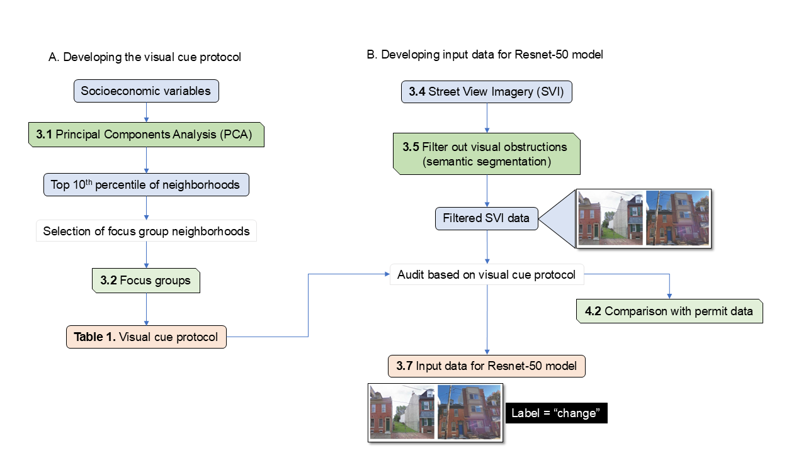

# Developing a machine learning model to map new-build gentrification: A mixed-methods approach
This repository accompaniees the paper:

**"Developing a machine learning model to map new-build gentrification: A mixed-methods approach"**

It provides code, processed data, and reproducible workflows for the study of new-build gentrification in Philadelphia using Street View Imagery, permit data, and community-informed protocols.


## 📂 Repository Structure
- `notebooks/` – PCA analysis, focus group protocol integration, data preparation, model training, validation
- `src/` – Core Python modules (data, models, training, utils)
- `data/` – Scripts and metadata for dataset creation (not raw imagery)
- `docs/` – figures, supplementary materials

## Getting Started
```bash
git clone https://github.com/urban-ai-lab/gentrification-newbuild-ml.git
cd gentrification-newbuild-ml
pip install -r requirements.txt
```
## Run training with:
```bash
python run_train.py

#This will, split your dataset into data/splits/train_set.csv and data/splits/val_set.csv and train the Siamese ResNet-50 model.
```
## Evaluation
```bash
python run_eval.py
```
###
📁 Data Notes
Raw Street View Imagery is not stored in this repo (too large, licensed).

pairs.csv contains processed metadata for building before/after pairs.

test_set.csv should be prepared manually and placed in data/.
